---

title: 'Encrypted Email Set-up for Mac'

abstract: This guide will help you set up encrypted email on Mac OS X. The [Access Helpline](https://www.accessnow.org/pages/tech#Digital%20Security%20Helpline) is at your service if you have any questions. 

---
|Last updated: July 2015| 
|-----------------------|
|Please consider this date when evaluating the accuracy and security of the following guide.|

|Before Beginning|
|----------------|
| In order to better protect the data on your computer, we highly recommend using device encryption. To do so, enable Mac's [FileVault](https://support.apple.com/en-us/HT204837) before starting this guide. |

Download and Install GPGTools
=============================

1. Download [GPG Suite](https://gpgtools.org/#gpgsuite), the encryption manager by clicking **Download GPG Suite**.  

   [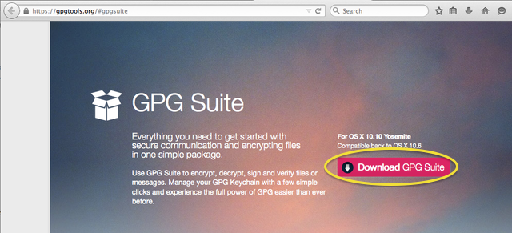](https://gpgtools.org/#gpgsuite)

2. Click [Save File](images/mac/images/macPgpGpgSuiteSave.png), and then click the download arrow in the top right of your browser. **Click the GPG Suite .dmg file** in your recent downloads.

   

3. Click [Install](images/mac/images/macPgpGpgSuiteInstallChoice.png). In the installation wizard, [click Continue](images/mac/images/macPgpGpgSuiteInstallerStart.png), then [Install](images/mac/images/macPgpGpgSuiteInstall.png).

Download and Install Thunderbird
=================================

1. Please visit [Thunderbird's website](https://www.mozilla.org/en-US/thunderbird/) to downloand this email application.

2. Click the green **Download Thunderbird** button.

   [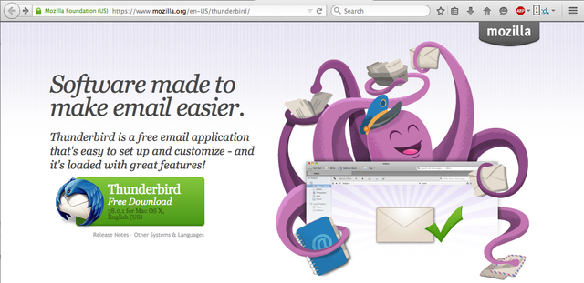](https://www.mozilla.org/en-US/thunderbird/)

3. [When prompted](images/mac/images/macPgpThunderbirdDownloadSave.png), select **Save File**. 

4. Click the download arrow in the top right of your browser. **Click the Thunderbird .dmg file** in your recent downloads.

   

5. When prompted, [Drag the Thunderbird icon](images/mac/images/macPgpDragDropThunderbirdToApplications.png) into your Applications folder.

Download and Install Enigmail
============================== 

Enigmail is an encryption/decryption add-on for Thunderbird. 

1. Open Thunderbird and **click the three-bar menu button**  on the far right.

   

2. Click **Add-ons**.

   [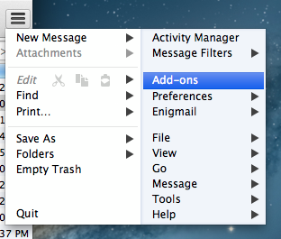](images/mac/images/macPgpThunderbirdMenuBarAddOnsFull.png)
   
3. Type "Enigmail" in the search field on the right. The first result should read "Enigmail", **click install**.

   
   
4. [When prompted](images/mac/images/macPgpInstallEnigmailRestart.png), restart Thunderbird to let the Add-on finalize its installation

Link Thunderbird to Your Existing Email 
=======================================

1. Add your existing email account to Thunderbird by navigating to Thunderbird's menu bar. Click **File**, then click **New**, then **Existing Mail Account**.

   

2. Fill out your complete name, your email address and your password. 
It’s important to fill out your First and Last name if you want the receiver to recognize you.

   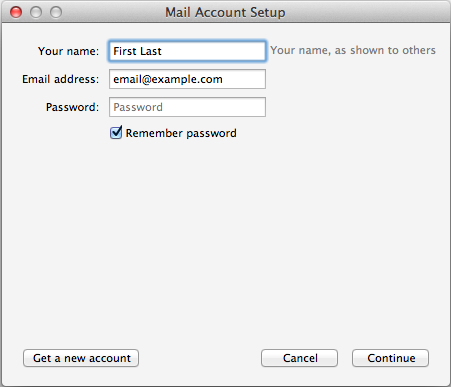

3. Click **Continue**.

Upgrade Thunderbird's Security Settings
---------------------------------------

1. Navigate to Thunderbird's menu bar, select **Tools** then **Account Settings**.

   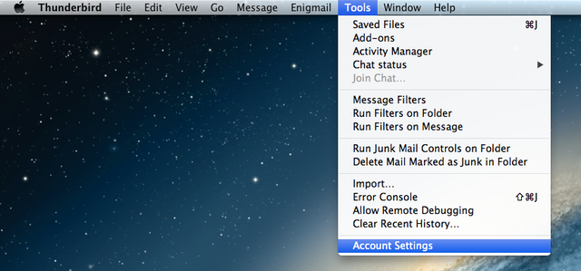

2. Click **OpenPgp Security** on the left. Everything should be checked. Make sure "Use specific OpenPGP key ID" is selected, with your public key below it. **Click OK**.

   

Create a Private and Public Key: Your Key Pair
=================================================

1. Go to the Thunderbird menu bar. Click **Enigmail** then choose **Key Management**.

   

2. A window should appear. Check Display All Keys by Default to the right of the Search box.

   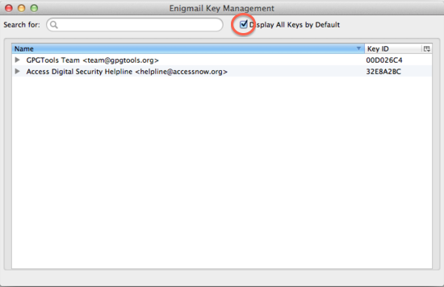

3. Go to **Generate** and choose **New Key Pair**.

   

4. Choose a secure passphrase (password) for your keys. It should be long, include special characters, capital letters and numbers. You must remember this passphrase. You may leave the "Comment" section blank.

   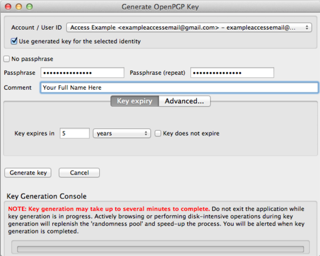

5. Click on the **Advanced tab** next to Key Expiry, and **confirm the key size is 4096**. 

   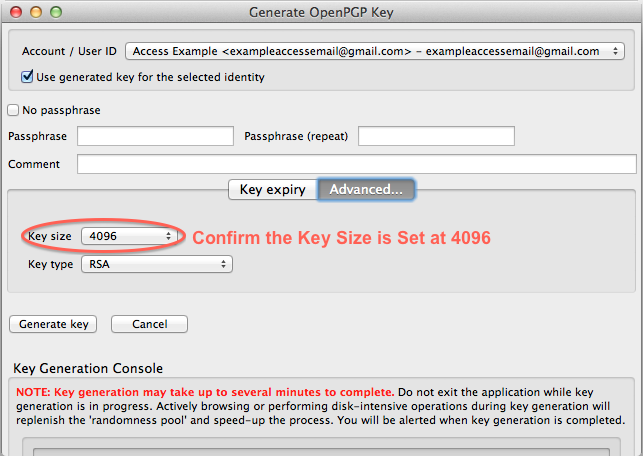

6. Click **Generate Key** and confirm.

|Note:|
|-----| 
|You will also be asked to [generate a revocation certificate](images/mac/images/macPgpGenerateRevocationCertificateAskFull.png). Please do so by clicking **Generate Certificate**, and save it in a secure location (like a usb stick that you keep for exclusive, personal use).| 

Find out more in the following section.

Generate a Revocation Certificate
=================================

This step will allow you to discontinue use of your key securely at any time. It is very important to create a revocation certificate for future use. Revoking your key will prevent people from encrypting to the revoked key, and signals to the keyservers that the key is no longer valid. 

If you did not create a revocation certificate in the section above, please do so now. 

1. Go to the Thunderbird Menu Bar. Find **Enigmail**, click, and choose **Key Management**.

    

2. Find the key that you would like to generate a revocation certificate for, and **right click** on it. 

3. Select **Generate and Save a Revocation Certificate** from the menu.

   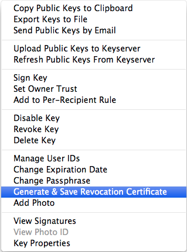

4. Choose a secure location to save your revocation certificate. A USB stick that you do not lend out and is kept for exclusive, personal use is a good choice.

   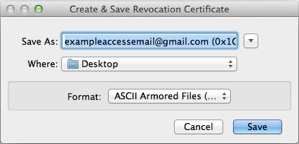

5. Type in your [passphrase](images/mac/images/macPgpEnterPassphrase.png), and **click OK**.

6. You will be [notified](images/mac/images/macPgpGenerateRevocationSuccessfulFull.png) the revocation key was successfully generated. **Click OK**.

Store Your Key Pair Somewhere Safe
==================================

This is important if you want to use encryption on another computer, or your hard drive is wiped.

1. **Right click your key** in [Key Management](images/mac/images/macPgpEnigmailKeyManagementFullAlt.png) and choose **Export Keys to File**.

   

2. Choose explicitly to **Export Secret Key**.
   
   
   
3. Choose where you would like the keys to be saved. 

   |Note:|
   |-----| 
   |Your keys are the most important component of the encryption system, and their security should be top priority. **Only export to a secure place**, like a [USB stick](images/mac/images/macPgpExportKeyToUsb.png) that you use exclusively and do not lend out.| 

4. Click **Save**. You should see a "[keys were successfully saved](images/mac/images/macPgpKeysSuccessfullySavedFull.png)" message.

Publish Your Public Key
========================

Others must import your public key to encrypt messages to you. To let others find your public key, you must upload your public key to a key server. Public keys are searchable by the email used or PGP Key ID. 

1. Go to Thunderbird's menu bar. Click **Enigmail**, then **Key Management**. 

   

2. Right click on your key and choose: **Upload Public Keys to Keyserver**.

   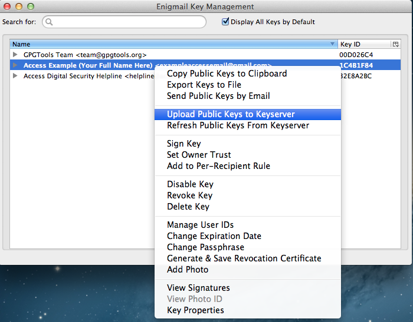

3. **Click OK**. Whatever keyserver you choose will be mirrored on the other servers, so choose any one.

   

Send Your First Encrypted Email
===============================

Download Your Receiver’s Public Key
-----------------------------------

1. Go to [Thunderbird's Menu Bar](images/mac/images/macPgpEnigmailKeyManagementFullAlt.png). Select **Enigmail**, then **Key Management**. Look to the menu bar again, and select **Key Server** then **Search for Keys**.

   

2. Search for a key by typing the email of the receiver or the ID of the PGP key|

   

3. **Select the key** from the import window and **click OK**.

   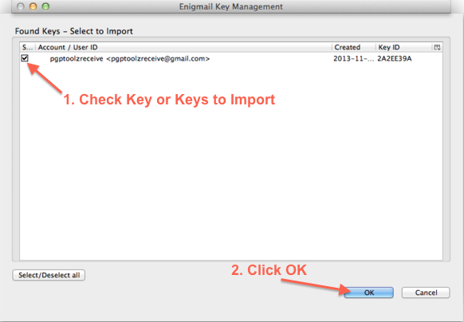

   A message will appear saying that the [key has been imported](images/mac/images/macPgpKeyImportedSuccessfully.png).

   Once the public key of the receiver is downloaded, you may send them an encrypted email.

Send the Email
--------------

1. In Thunderbird's window, click **Write** on the top left.

   

2. Confirm the **Lock is locked** and the **Pencil is highlighted**. This shows the email is encrypted and signed. If it is not [review Thunderbird's security settings](#Upgrade Thunderbird's Security Settings) before continuing.

   

3. Type the receiver's email address in To, write the Subject and your email message. **Click send** when complete.

   |Security Note:|
   |--------------| 
   |**The Subject of the email is never encrypted**. _Do not_ write private information in the subject line under any circumstances.|

   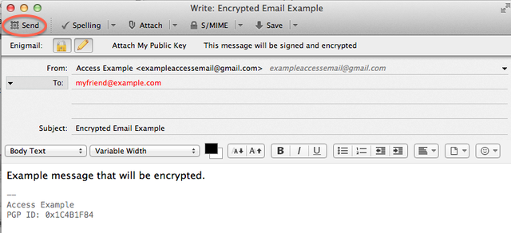

4. After clicking Send, you must [fill out your Passphrase](images/mac/images/macPgpEnterPassphrase.png) and **press OK**.

If you have any questions or problems, please send an email to <help@accessnow.org>. Our Tech team will be happy to help.

Add Your PGP ID to Your Email Signature
=======================================

1. Navigate to Thunderbird's menu bar, select **Tools**, then [Account Settings](images/mac/images/macPgpThunderbirdAccountSettings.png).

2. Find your PGP key under OpenPGP Security and **copy it**. 

     
   
3. Look under Signature text. Type your public key (found under OpenPGP Security) into your signature.

   

----------

This guide was brought to you by [Access](https://www.accessnow.org). 

**Share** -- Copy and redistribute the material in any medium or format.

**Adapt** -- Remix, transform, and build upon the material.

**Noncommercial** -- You may not use the material for commercial purposes.